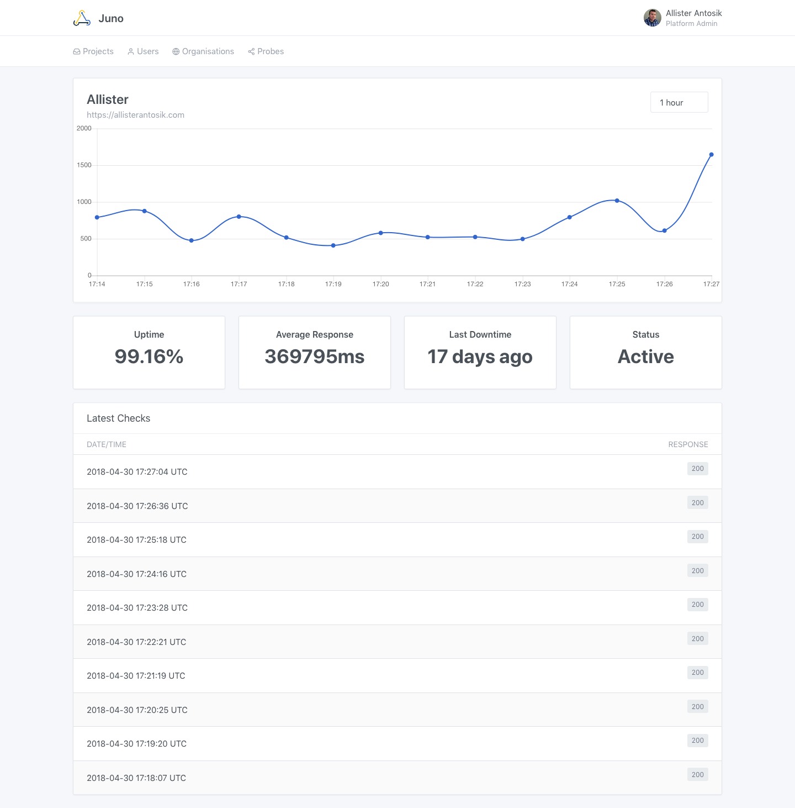

# Juno

[](https://travis-ci.org/allistera/juno)
[](https://codeclimate.com/github/allistera/juno/coverage)

[Juno Trello Board](https://trello.com/b/1KHVf8Z5/juno)



## Features

* HTTP Health Checking
* Custom Status Codes
* Slack Notifications
* Multi-User / Multi-Tenant

## Requirements

There are no dependencies except having Docker and Docker-Compose installed.

## Quick Start

```
$ git clone https://github.com/allistera/juno.git
$ cd juno
$ docker-compose up
```

The first time Juno is ran you will need to create an administrator account:

```
$ docker exec -d juno bundle exec rake user:create_admin[foo@bar.com,Password,Organisation]
```

Replacing the Email Address, Password and Organisation with your own.

Once all the services have started browse to [http://localhost:3000](http://localhost:3000) and login.

## Contribute

Feel free to open a pull request or issue report. Please include tests and keep an eye on code coverage and rubocop.

## License

[Unlicense](UNLICENSE)
